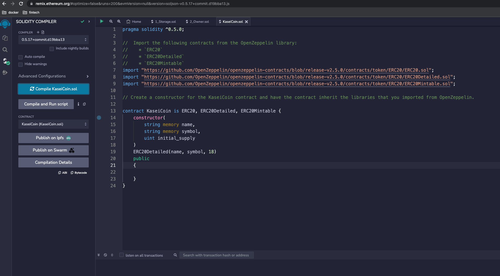
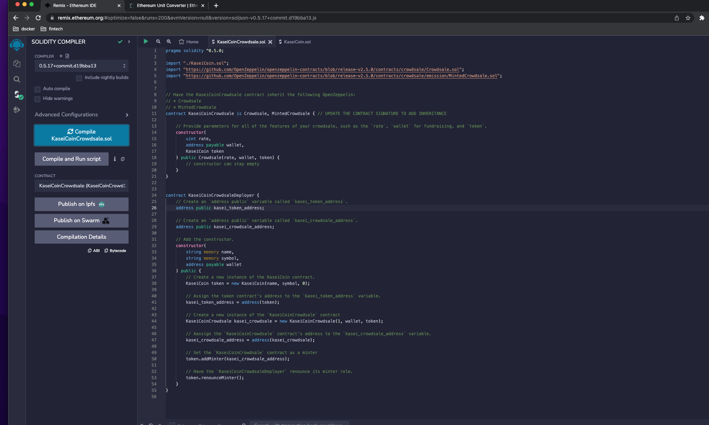

# KaseiCoin Cryptocurrency Smart Contract App

## Table of Contents

 1. Project Motivation
 2. About the Application
 3. Techologies Used
 4. Directory and files
 5. License
 

----------------------------

##  Project Motivation

This project is in completion of the Columbia University FinTech 2022 bootcamp module twenty one weekly challenge exercise.

## About the Application

Using smart contract and blockchain technology, develop a new cryptocurrent called KaseiCoin which will be used as monetary system in the first human colony on Mars.

## Technologies Used

The application is written in solidarity programming langauge. Users need a device that can run Remix IDE, Metamask and  Ganache. 

## Directory and files
 - Starter_Code
   1. KaseiCoin.sol
   2. KaseiCoinCrowdsale.sol
 - Resources
   1. compile_KaseiCoin.png
   2. compile_KaisenCoinCrowdsale.png
    etc

  1. Compile Kaseicoin

  2. Compile KaseinCoinCrowdsale

## License
This project is in completion of the Columbia University FinTech 2022 bootcamp module twenty one weekly challenge exercise. It should not be copied and used for commercial purpose without the authorization of the admin of this repo. For futher information please contact Patrick via email on pruejoma@gmail.com